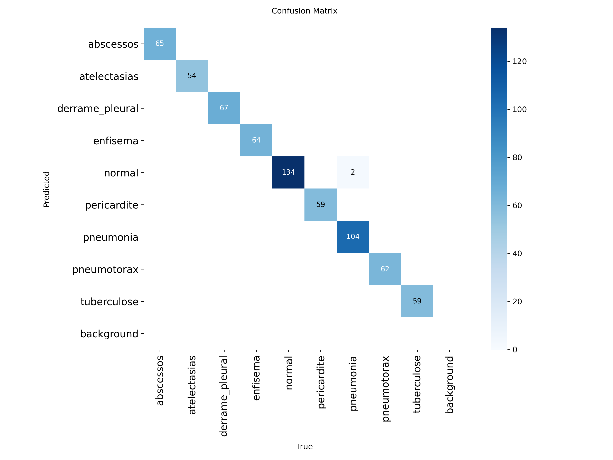
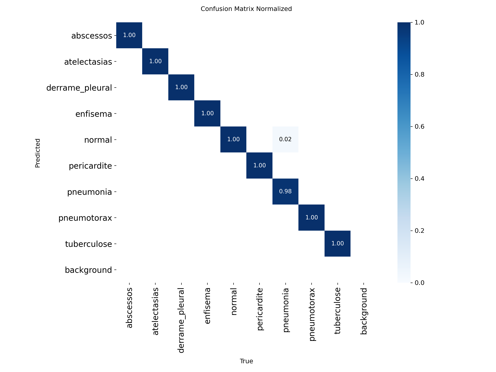

# 🧠 YOLOv8 X-Ray Disease Classification

A deep learning-based system for detecting lung diseases from chest X-ray images using YOLOv8 classification models, combined with a Streamlit web interface and a continuous learning pipeline.

---

## 🚀 Features

* 🧠 YOLOv8-based multi-class classification (9 disease classes)
* 🩺 Detection of lung diseases from chest X-ray images
* 🌐 Interactive Streamlit web interface
* ⚡ Real-time prediction with confidence scores
* 📊 Confusion matrix-based evaluation
* 🔁 Retrainable model with feedback (continuous learning)
* 📈 High-performance classification results

---

## 🌐 Web Interface

A simple and user-friendly Streamlit interface allows interaction with the model:

* Upload X-ray images
* Get instant predictions
* View confidence scores

---

## 🧪 Data Processing

* Image resizing for consistent input size
* Basic data cleaning and preprocessing
* Dataset preparation for classification tasks

---

## 🛠️ Tech Stack

* Python
* YOLOv8 (Ultralytics)
* OpenCV
* NumPy
* Streamlit

---

## 📊 Model Performance

The model was trained and evaluated on a multi-class chest X-ray dataset.

### 📈 Metrics Summary

| Metric    | Value    |
| --------- | -------- |
| Accuracy  | ~98-100% |
| Precision | ~98%     |
| Recall    | ~98%     |
| F1 Score  | ~98%     |

---

## 🔍 Confusion Matrix

### Raw Confusion Matrix



### Normalized Confusion Matrix



---

### 📊 Observations

* Most classes are classified with near-perfect accuracy
* Very low misclassification between disease categories
* Minor confusion observed between:

  * **Normal ↔ Pneumonia**

The model demonstrates strong generalization and reliability.

---

## 🔁 Continuous Learning (Feedback System)

This project includes a feedback mechanism that allows improving the model over time.

* Users can review incorrect predictions
* Misclassified samples can be collected
* The model can be retrained with new corrected data

This enables a **self-improving system** that evolves with new inputs.

---

## 📂 Dataset

This project uses a publicly available dataset from Kaggle:

🔗 https://www.kaggle.com/datasets/fernando2rad/x-ray-lung-diseases-images-9-classes?select=00+Anatomia+Normal

> Note: Dataset belongs to the original authors and is used for educational purposes.

---

## ⚙️ Installation

```bash
git clone https://github.com/goktugbk/yolov8-xray-classification.git
cd yolov8-xray-classification

pip install -r requirements.txt
streamlit run main.py
```

---

## 🧪 Usage

1. Upload a chest X-ray image
2. Model predicts the disease class
3. View prediction confidence
4. Provide feedback (optional)

---

## 📁 Project Structure

```
.
├── main.py
├── train_update.py
├── helper.py
├── feedback_utils.py
├── data/
├── models/
├── screenshots/
└── README.md
```

---

## 📌 Project Status

🚧 This project is under active development and improvement.

---

## 👨‍💻 Author

**Göktuğ Berke Karataş**
Computer Engineering Student | AI Developer

🔗 LinkedIn: https://www.linkedin.com/in/g%C3%B6ktu%C4%9F-berke-karata%C5%9F-88ba113b9/
💻 GitHub: https://github.com/goktugbk

---

## ⭐ Support

If you like this project, give it a ⭐ on GitHub!
