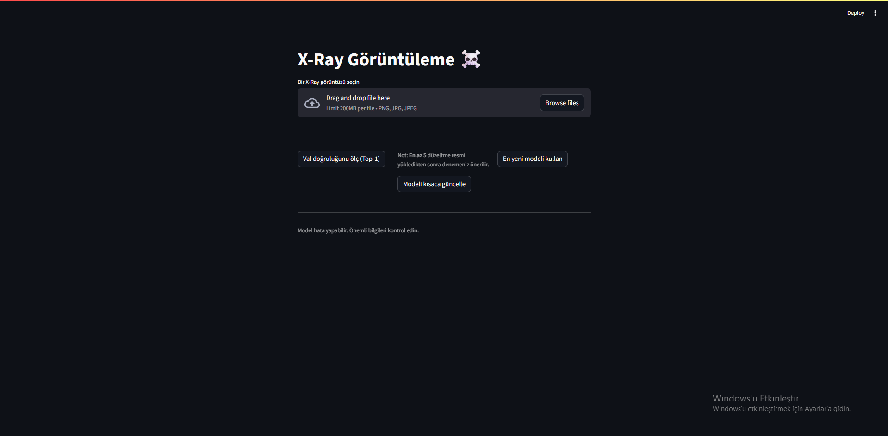
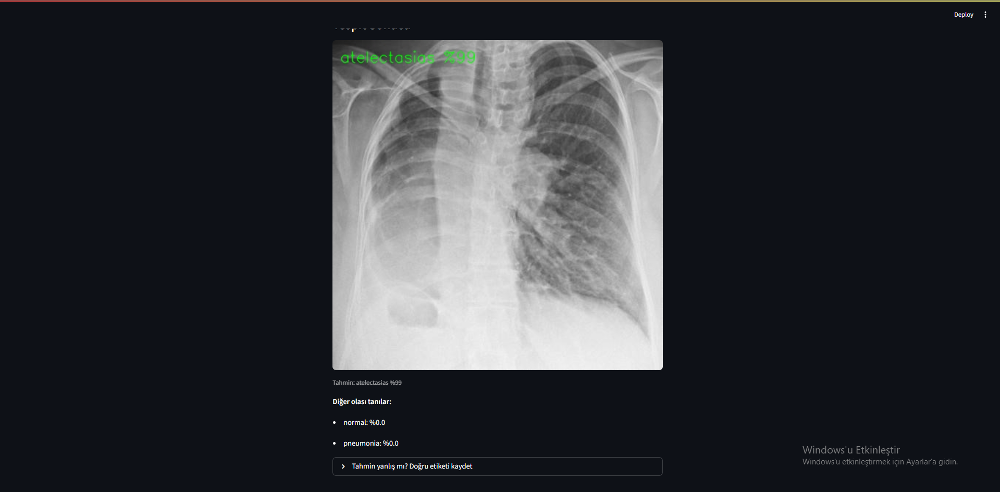
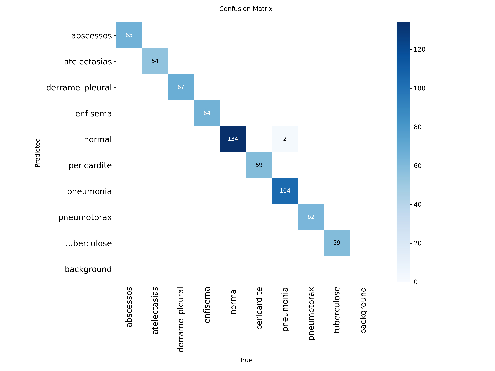
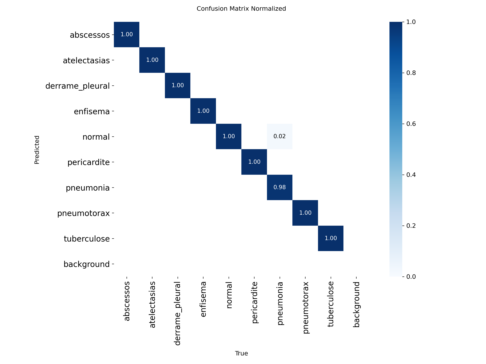

# YOLOv8 X-Ray Disease Classification

Nine-class lung disease classification from chest X-ray images, wrapped in a Streamlit interface
with a feedback loop that lets the model be retrained on corrected predictions.

Started as an internship project and extended into my final-year capstone.

---

## What it does

- Classifies a chest X-ray into one of **9 classes**: abscess, atelectasis, pleural effusion,
  emphysema, normal, pericarditis, pneumonia, pneumothorax, tuberculosis
- Returns a prediction with a confidence score through a Streamlit web interface
- Collects predictions the user marks as wrong, so the model can be retrained on them
- Ships the evaluation it was measured with, not just a claim

## Interface





Upload an X-ray, get a class and a confidence score, and flag the result if it looks wrong.

## Model

| | |
|---|---|
| Architecture | `yolov8l-cls` (Ultralytics classification head) |
| Initialisation | ImageNet-pretrained |
| Epochs | 25 |
| Image size | 224 × 224 |
| Batch size | 16 |

## Dataset

[X-ray lung diseases, 9 classes](https://www.kaggle.com/datasets/fernando2rad/x-ray-lung-diseases-images-9-classes)
on Kaggle — pre-labelled, used for educational purposes. The dataset belongs to its original
authors and is **not** redistributed in this repository.

| Split | Images | Used for |
|---|---|---|
| train | 5,431 | Training |
| val | 670 | Monitoring during training, model selection |
| test | 681 | Final evaluation only |
| **Total** | **6,782** | |

The three splits share no files. The dataset carries no patient identifiers, so a patient-level
split was not possible — worth knowing when reading the numbers below.

## Results

Measured with Ultralytics on `yolov8l-cls`:

| Split | Images | Top-1 | Top-5 |
|---|---|---|---|
| **test** — held out, never used for model selection | 681 | **98.97%** | 100% |
| val | 670 | 98.66% | 99.85% |

The test and validation scores agree closely, which is the main reason to trust them: a model that
had memorised its training data would score far better on the split it was tuned against than on
one it never influenced.

### Confusion matrix





Almost all classes separate cleanly. The only recurring confusion is **pneumonia ↔ normal**, which
is also the pair where a mistake costs most — a missed pneumonia reads as a healthy lung.

## Feedback loop

Predictions the user flags as wrong are stored with their corrected label. Those samples can then
be folded back into training, so the model improves on exactly the cases it got wrong rather than
on more of what it already handles.

This is the part that was added after the internship, for the capstone version.

## Install

```bash
git clone https://github.com/goktugbk/yolov8-xray-classification.git
cd yolov8-xray-classification

python -m venv .venv
.venv\Scripts\activate      # Linux/macOS: source .venv/bin/activate
pip install -r requirements.txt

streamlit run main.py
```

Trained weights are not committed here. Point `models/best.pt` at your own checkpoint, or train
one from the dataset above:

```bash
yolo classify train model=yolov8l-cls.pt data=data/dataset_classification epochs=25 imgsz=224
```

Expected layout, with the dataset in Ultralytics classification format:

```
data/dataset_classification/{train,val,test}/<class_name>/*.jpg
models/best.pt
```

## Files

| File | Role |
|---|---|
| `main.py` | Streamlit app: upload, predict, collect feedback |
| `helper.py` | Model loading and prediction helpers |
| `feedback_utils.py` | Storing and reading flagged predictions |
| `train_update.py` | Retraining on collected feedback |

## Limitations

This is a student project, not a medical device. It was trained on one public dataset and
evaluated on one held-out split from that same dataset. It has never been tested against images
from a different hospital, scanner or population — which is where classifiers like this usually
lose most of their accuracy. It is not a diagnostic tool and must not be used as one.

## Author

**Göktuğ Berke Karataş** — computer engineering, graduating October 2026

[GitHub](https://github.com/goktugbk) · [LinkedIn](https://www.linkedin.com/in/goktug-berke-karatas/)
